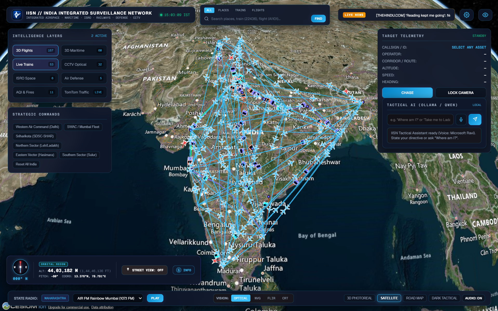
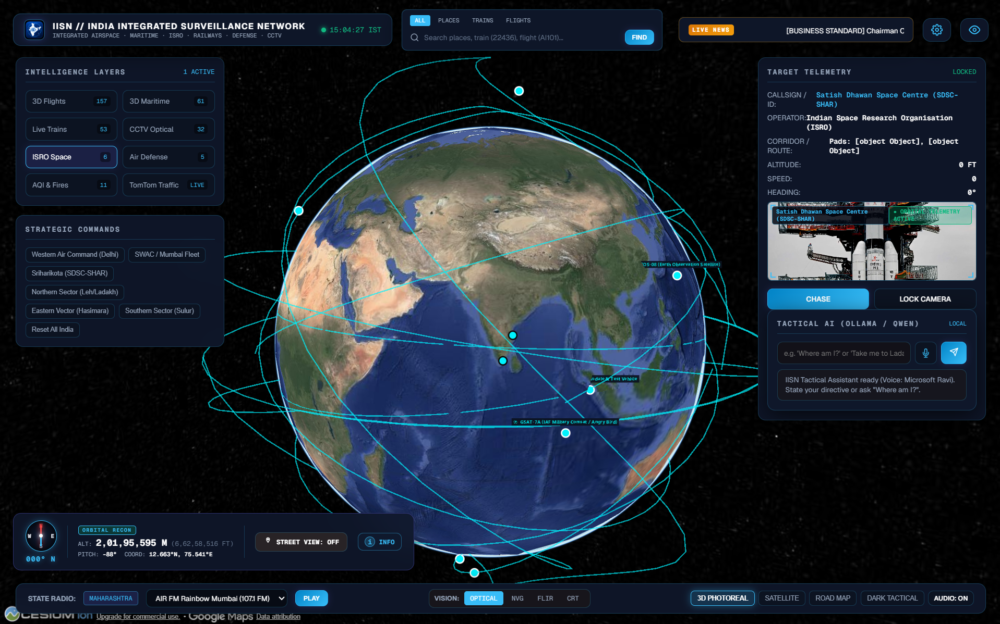
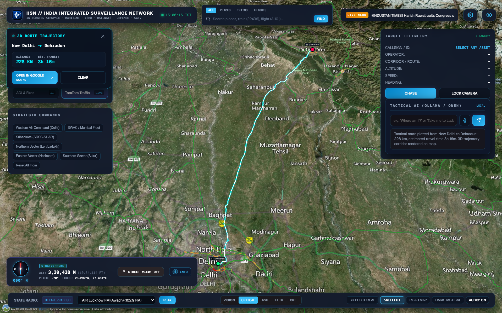
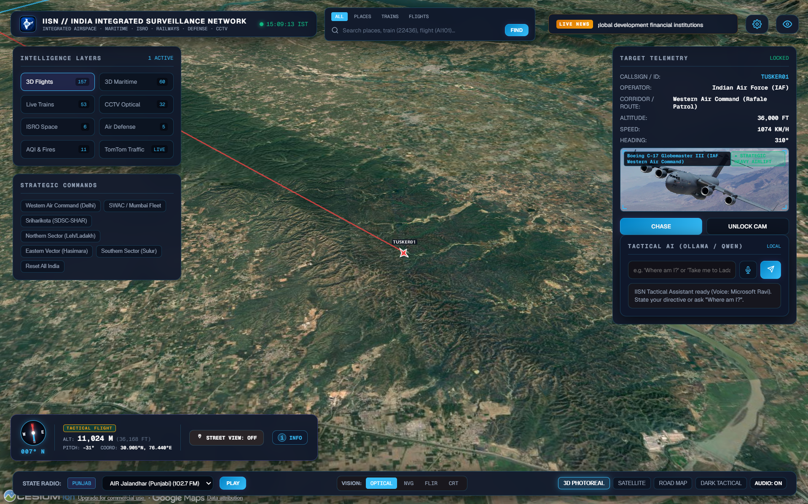
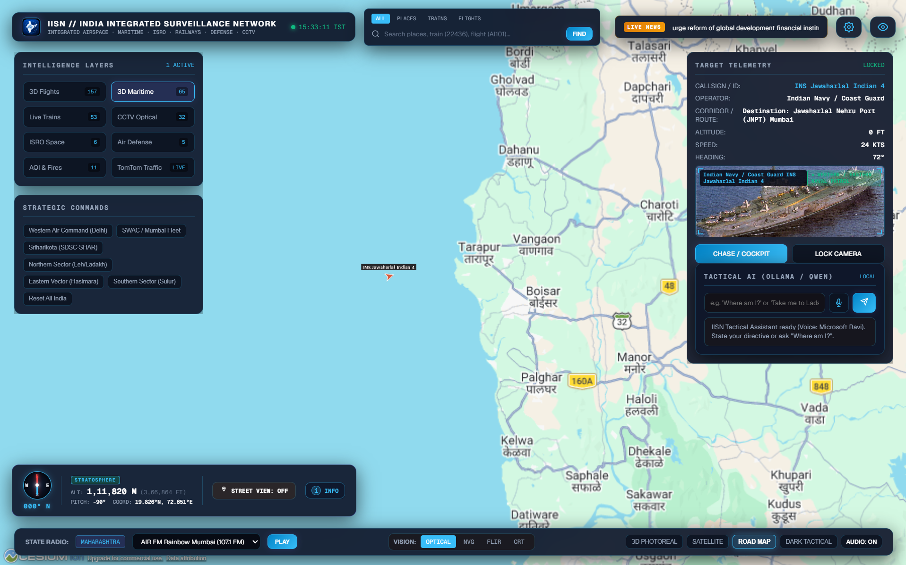
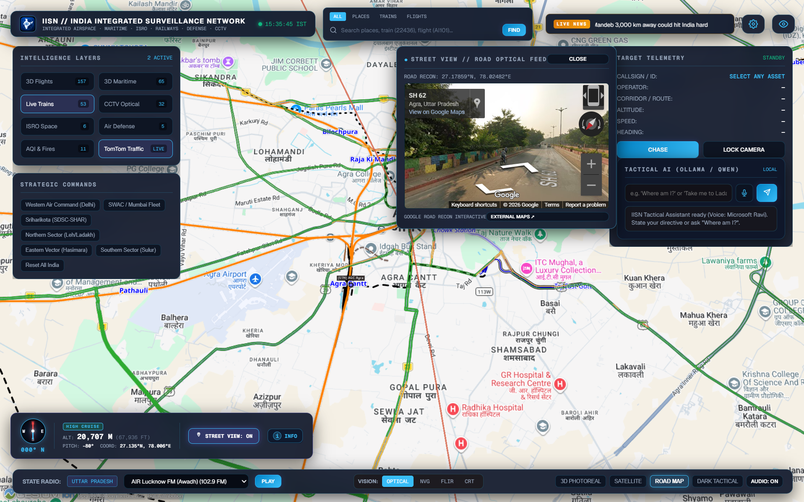
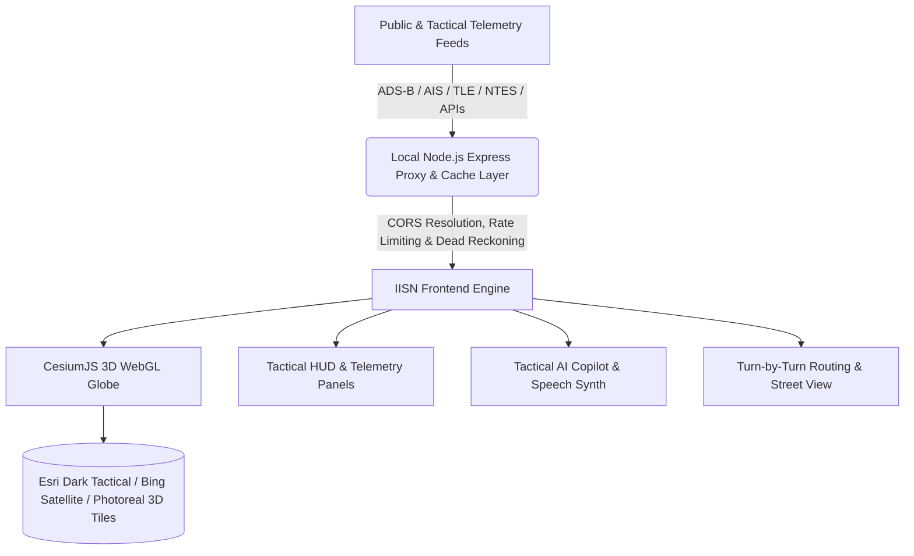

# 🇮🇳 INDIA INTEGRATED SURVEILLANCE NETWORK (IISN)
### Next-Gen 3D Geospatial Intelligence & Tactical Situational Awareness Console

[]()
[]()
[]()
[]()
[]()

> *Inspired by the concept of [**God's Eye View**](https://github.com/bilawalsidhu/gods-eye-view) by Bilawal Sidhu — re-engineered and specialized for high-precision 3D surveillance, airspace tracking, railway telemetry, maritime monitoring, ISRO orbital propagation, and national situational awareness across the Indian Subcontinent.*

---

## 📸 Tactical Console Showcase & Capabilities

A complete 3D digital twin of India's multi-domain operational environment — featuring real-time flight telemetry, railway networks, maritime AIS tracking, ISRO satellite orbits, ground routing, and interactive street reconnaissance.

| ✈️ 3D Airspace & Indian Railways Telemetry | 🛰️ ISRO Orbital Trajectories & Air Defense |
| :---: | :---: |
|  |  |
| *Real-time commercial & defense flight corridors, altitude paths, and national railway networks on Bing Satellite imagery.* | *SGP4 orbital propagation for ISRO missions (Chandrayaan, GSAT, Aditya-L1) with strategic air defense radar envelopes.* |
| 🧭 **3D Tactical Route Planning (Delhi ➔ Dehradun)** | 🎯 **Aircraft Target Telemetry & Recon Intel** |
|  |  |
| *Turn-by-turn 3D routing trajectory across Indian terrain with dynamic waypoint telemetry, distance calculation, and live ETA HUD.* | *Single-click target lock displaying live ADS-B telemetry, transponder squawk, altitude profile, callsign photo recon & Wikipedia intelligence dossier.* |
| ⚓ **Indian Navy & Coastal Maritime AIS** | 🏙️ **Road Infrastructure & Embedded Street View** |
|  |  |
| *Live AIS vessel transponders, Indian Navy task group tracking across the Arabian Sea, Indian Ocean, and Bay of Bengal with nautical routing.* | *High-contrast Google Maps road grid integrated with 360° ground-level Street View reconnaissance and local infrastructure context.* |

---

## 🌐 What is IISN?

The **India Integrated Surveillance Network (IISN)** is an integrated, web-native 3D Command & Control (C2) and Geospatial Intelligence (GEOINT) situational awareness workstation. Designed for researchers, defense analysts, operations commanders, and geospatial enthusiasts, IISN unifies disparate public and tactical data streams across India into a single, high-performance 3D visualization platform.

### Key Capabilities at a Glance:
* **Multi-Domain Common Operating Picture (COP)**: Integrates aviation, railways, maritime vessels, space assets, traffic, weather, and environmental sensors into a unified coordinate system.
* **Zero-Lag 60 FPS Performance**: Optimized WebGL rendering with smart camera-distance Level of Detail (LOD), viewport culling, and entity clustering.
* **Keyless Out-of-the-Box Operation**: Fully functional immediately upon launch without requiring third-party API tokens.
* **Tactical AI Copilot & Voice Dispatch**: Natural language intelligence query assistant paired with voice dispatch and procedural military-grade radio sound effects.
* **First-Person 3D Chase Mode**: Lock onto any active aircraft, train, or vessel and ride along in a dynamic third-person or cockpit follow camera.

---

## ⚡ How It Works (Technical Architecture)



### 1. 3D WebGL Geospatial Rendering Engine
* Powered by **CesiumJS**, rendering the Earth as an accurate WGS84 ellipsoid.
* Default basemap utilizes **Esri World Dark Canvas** for high-contrast tactical readability with zero API key dependencies.
* Supports seamless 1-click elevation toggles to **Bing Satellite Imagery** and **Google Photorealistic 3D 3D-Tiles** via Cesium Ion.

### 2. Multi-Source Telemetry Ingestion & Proxy Layer
* **Backend Proxy (`server.js`)**: Resolves CORS restrictions, aggregates live data, handles SSL handshakes, and provides in-memory caching to avoid rate-limiting.
* **Dead Reckoning & Interpolation**: Smoothly calculates position intervals between raw pings so moving entities (flights, trains, ships) glide seamlessly across the globe.
* **SGP4 Orbital Mechanics**: Uses true Two-Line Element (TLE) datasets from CelesTrak to compute real-time orbital ephemerides for ISRO satellites.

### 3. Level-of-Detail (LOD) & Distance-Based Decluttering
* **Adaptive Visibility Culling**: Dense flight paths and railway corridors dynamically scale and declutter based on camera altitude. Global overviews show major strategic corridors; zooming into regional altitudes seamlessly reveals local transit lines and individual aircraft headings without dropping framerates.

### 4. Integrated Tactical Audio & Voice Engine
* Procedural Web Audio synthesizer generating authentic military radio beeps, squelch chirps, and telemetry lock sounds.
* Integrated Web Speech API synthesized tactical narrator voice that announces target acquisitions, route calculations, and security alerts.

---

## 🛰️ Integrated Operational Layers

| Layer | Source / Protocol | Description |
|:---|:---|:---|
| ✈️ **Airspace (ADS-B)** | OpenSky Network / ADS-B Exchange | Live commercial and military aircraft with altitude, speed, squawk code, callsign lookup, and 3D flight paths. |
| 🚆 **Indian Railways** | RailRadar / NTES Feeds | Live express, freight, and Vande Bharat trains across major regional railway corridors with live speed and heading. |
| ⚓ **Maritime AIS** | AISStream / MarineTraffic Proxy | Indian Navy naval task groups and commercial container ships navigating the Indian Ocean, Arabian Sea, and Malacca Strait. |
| 🛰️ **ISRO Satellites** | CelesTrak / NORAD TLE | Real-time orbital paths for ISRO missions: Cartosat, GSAT, Chandrayaan, Aditya-L1, RISAT, and NavIC. |
| 🛡️ **Air Defense Grid** | Tactical Simulation Nodes | S-400 Triumf, Akash SAM, and DRDO radar coverage envelopes across northern and coastal sectors. |
| 📹 **CCTV & Street View** | Public Feeds & Google Street View | Municipal traffic feeds and interactive 360° ground-level Street View reconnaissance. |
| 🧭 **3D Tactical Routing** | OSRM / TomTom Routing API | High-precision road navigation with elevation-aware waypoints, turn-by-turn directions, and live ETA calculation. |
| 🌪️ **Weather & Hazards** | Open-Meteo / NASA FIRMS / WAQI | Live cloud cover, precipitation radar, thermal wildfire hot spots, and ambient Air Quality Index (AQI) monitoring. |

---

## 🚀 Quick Start & 1-Click Launch

### Windows 1-Click Batch Run (Recommended)
Simply double-click **`launch-iisn.bat`** in the root directory.
* Automatically terminates any stale background processes on port 5200.
* Starts the backend proxy server and launches a dedicated borderless browser window.

### Manual Launch (Cross-Platform: Windows, macOS, Linux)

```bash
# 1. Clone the repository
git clone https://github.com/Aditya0973/india-integrated-surveillance-network-exp.git
cd india-integrated-surveillance-network-exp

# 2. Install dependencies
npm install

# 3. Start the console
npm start
```

Open your browser and navigate to **`http://localhost:5200`**.

---

## 🌟 Keyless Out-of-the-Box Operation

IISN is engineered to work **100% out of the box with zero required API keys**:
* **Default Basemap**: Launches on the high-contrast **Esri World Dark Tactical Canvas** with no token requirements, rock-solid 60 FPS, and instantaneous loading.
* **Instant Cloud / Vercel Access**: Anyone visiting your deployed URL immediately gets the complete 3D interactive globe with live telemetry without needing to input API credentials.
* **Optional Enhancements**: You can optionally configure a free Cesium Ion token or TomTom key in **`[ ⚙ CONFIG ]`** to unlock high-res Bing Satellite, Google 3D Tiles, or custom routing profiles.

---

## 🌐 Deploying to Vercel (Web Deployment)

IISN includes native Vercel serverless configurations (`vercel.json` and `api/index.js`):

1. Fork or push this repository to your GitHub account.
2. Import the project into [Vercel](https://vercel.com).
3. (Optional) Set your Environment Variables (`CESIUM_ION_TOKEN`, `TOMTOM_API_KEY`, etc.) in the Vercel Project Settings.
4. Click **Deploy**!

---

## 🎮 Keyboard & Tactical Shortcuts

| Key / Action | Function |
|:---|:---|
| **Left Click + Drag** | Smooth 3D Orbit & Spatial Pan |
| **Right Click + Drag** | 3D Perspective Pitch & Tilt Angle |
| **Shift + Scroll** | Turbo Altitude Zoom (3.5x Speed) |
| **Ctrl + Scroll** | Micro Precision Ground Zoom (0.25x Speed) |
| **Space / H** | Toggle Tactical HUD Overlay |
| **C** | Engage / Exit 3D Cockpit Follow Camera |
| **Esc** | Clear Target Lock / Reset Route Planner |
| **Click Compass** | Smoothly Re-align Camera to True North (000°) |

---

## 🔒 Privacy & Security

* **No Hardcoded Credentials**: All API tokens and tactical configurations are loaded dynamically via environment variables (`.env`) or local runtime storage.
* **Zero Telemetry Leakage**: Client queries stay local or route through the secure proxy layer without third-party tracking.
* **Open Source & Extensible**: Modular architecture allows rapid integration of custom GeoJSON layers, proprietary drone telemetry feeds, or local sensor grids.

---

## 📜 Acknowledgements & Inspirations

* Inspired by [**God's Eye View**](https://github.com/bilawalsidhu/gods-eye-view) by Bilawal Sidhu.
* 3D Globe visualization powered by [**CesiumJS**](https://cesium.com/cesiumjs/).
* Telemetry feeds courtesy of OpenSky Network, AISStream, Indian Railways, ISRO, NASA FIRMS, WAQI, and CPCB.

---

<div align="center">
  <sub>Engineered for situational awareness, airspace monitoring, and geospatial intelligence across India.</sub>
</div>

