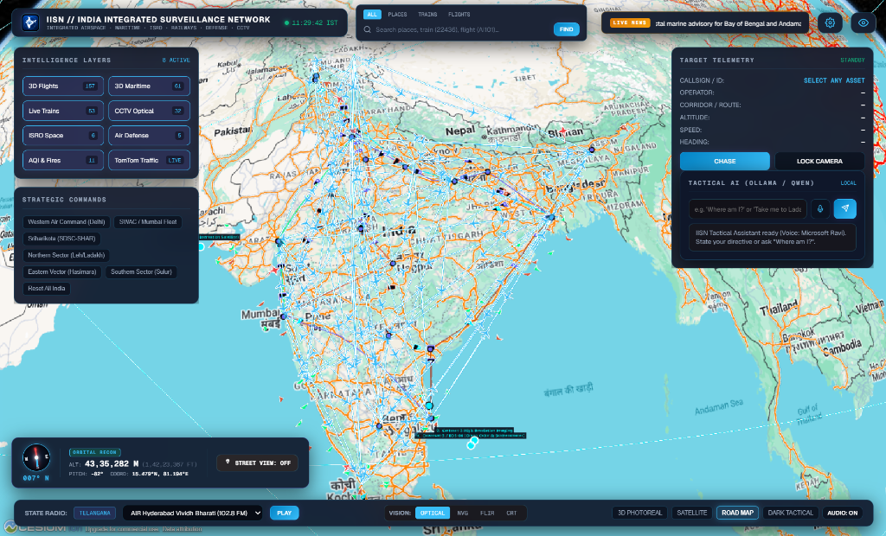
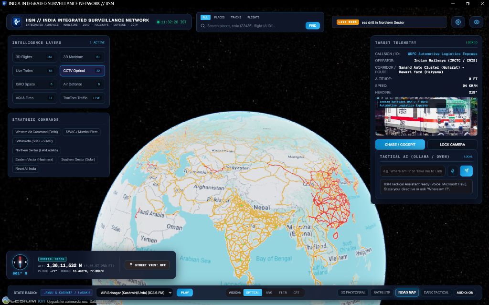
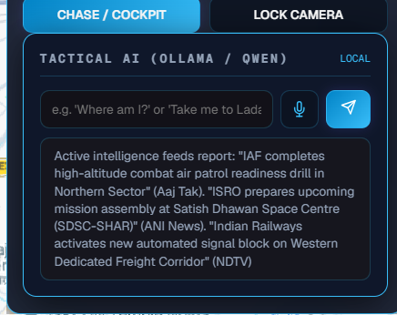
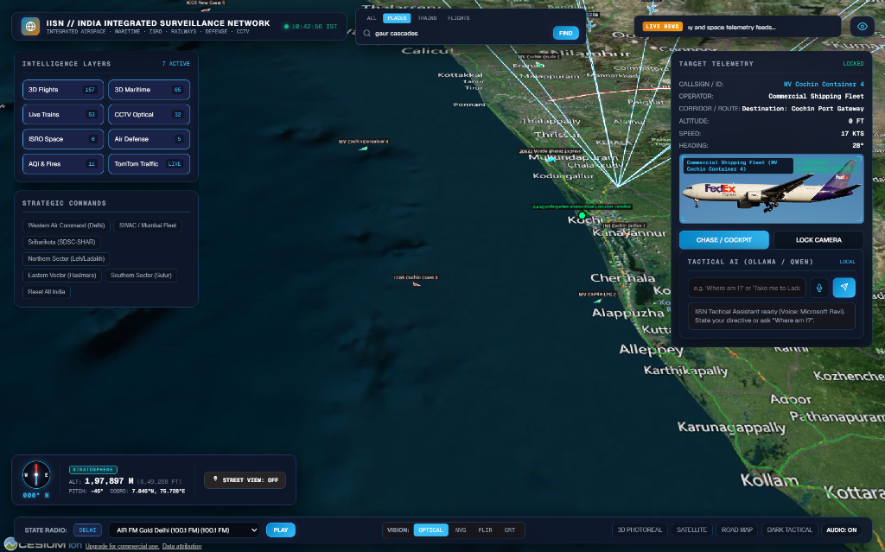

# 🇮🇳 INDIA INTEGRATED SURVEILLANCE NETWORK (IISN)
### Next-Gen 3D Geospatial Intelligence & Tactical Situational Awareness Console

> *Inspired by the concept of [**God's Eye View**](https://github.com/bilawalsidhu/gods-eye-view) by Bilawal Sidhu — engineered specifically for high-precision surveillance, airspace tracking, railway telemetry, maritime monitoring, and national situational awareness across the Indian Subcontinent.*

---

## 📥 Direct Download (Windows Desktop App)

You do **not** need to install Node.js, dependencies, or build from source:
* 📦 **[Download Pre-Built Windows Standalone Release (v2.0.0)](https://github.com/Aditya0973/india-integrated-surveillance-network-exp/releases)**
* Extract the `.zip` anywhere on your PC and double-click **`IISN Tactical Console.exe`** to launch instantly.

---

## 🌟 Overview & Philosophy

The **India Integrated Surveillance Network (IISN)** is an open-source, glassmorphism 3D geospatial intelligence platform built on **CesiumJS**, **Google Photorealistic 3D Tiles**, **TomTom Traffic Flow**, **AISStream Maritime WebSockets**, **NASA FIRMS**, **WAQI / CPCB**, and **Tactical AI (Ollama / Qwen2.5 / OpenRouter / OpenAI)**.

### 🛡️ Zero Fake Data Policy
Every visual entity in IISN corresponds directly to real-world geospatial telemetry:
* **Live Commercial & IAF Flights**: Real-time course vectors and 3D trajectory trails across Indian airspace.
* **Live Indian Railways Trains**: Real-time tracking of Vande Bharat, Rajdhani, Shatabdi, and Dedicated Freight Corridors (DFC) clamped onto 3D terrain.
* **Live Maritime AIS Vessels**: Ships transmitting live position reports across the Indian Ocean and Arabian Sea.
* **ISRO Orbital Fleet**: Accurate satellite Keplerian trajectories and spaceport launch pads (SDSC-SHAR).
* **Dynamic Breaking News RSS**: Real-time headline aggregation from major Indian media channels.
* **Live State FM Radio Directory**: Dynamic audio playback geofenced to Indian states.

---

## 📸 Tactical Interface & Layer Previews

| 3D Tactical Surveillance Overview | Airspace & Rail Corridors |
|:---:|:---:|
|  |  |

| Tactical AI Directives & News | 3D Photoreal Globe Recon |
|:---:|:---:|
|  |  |

---

## ⚡ Key Capabilities

1. **Clean Baseline by Default**:
   * Launches with a pristine 3D photorealistic globe without visual clutter. Users toggle specific intelligence layers on-demand.
2. **3D Route Planner & Corridor HUD**:
   * Calculate real-time 3D driving routes across India (e.g. *"Plan route from Delhi to Agra"*).
   * Renders glowing 3D trajectory corridors with distance, transit time, and one-click Google Maps navigation handoff.
3. **Tactical AI Mastermind (Voice + Text)**:
   * Real-time spatial awareness (*"Where am I?"*).
   * Live train and flight chase lock (*"Track Vande Bharat Express from Bhopal"*).
   * Dynamic travel intelligence and hotel recommendations for major Indian hubs.
   * Real-time breaking news briefings from Google News, ANI, and DD News.
4. **GPU-Accelerated 60 FPS Engine**:
   * Full discrete GPU hardware acceleration switches for buttery smooth 60 FPS camera navigation.
   * Smart Level-of-Detail (LOD) memory management and ground collision protection.
5. **Tactical Intelligence Legend**:
   * Detailed breakdown of flight color coding, railway fleets, ISRO orbits, CCTV frustums, keyboard shortcuts, and AI commands.

---

## 🚀 Quick Start (Local Desktop Run)

### 1. Prerequisites
* **Node.js**: v18.0.0 or higher
* **Ollama (Optional)**: For local AI voice & directives (`ollama run qwen2.5:7b`)

### 2. Installation
```bash
# Clone repository
git clone https://github.com/Aditya0973/india-integrated-surveillance-network-exp.git
cd india-integrated-surveillance-network-exp

# Install dependencies
npm install
```

### 3. Environment Configuration
Copy `.env.example` to `.env` and add your free developer keys:
```bash
cp .env.example .env
```

| Variable | Description | Get Free Token |
|:---|:---|:---|
| `CESIUM_ION_TOKEN` | Google Photorealistic 3D Tiles & Bing Satellite | [ion.cesium.com](https://ion.cesium.com/) |
| `TOMTOM_API_KEY` | Live Indian Road Traffic Flow Overlays | [developer.tomtom.com](https://developer.tomtom.com/) |
| `AISSTREAM_API_KEY` | Real-time Indian EEZ Maritime AIS WebSocket | [aisstream.io](https://aisstream.io/) |
| `NASA_FIRMS_KEY` | Thermal Hotspots & Wildfire Sensors | [firms.modaps.eosdis.nasa.gov](https://firms.modaps.eosdis.nasa.gov/api/map_key) |
| `AQICN_TOKEN` | Real-time Air Quality Sensors (CPCB / WAQI) | [aqicn.org](https://aqicn.org/data-platform/token/) |

### 4. Launch Desktop Console
```bash
# Start IISN Desktop Electron App
npm run electron

# Or start Backend Web Proxy
npm start
```
Visit `http://localhost:5200` in any modern browser (Chrome, Edge, Firefox, Brave).

---

## 📦 Building Standalone Desktop Executable (.EXE)

To create a standalone Windows `.exe` package:
```bash
npm run package
# Or for portable distributor executable:
npm run dist
```
The compiled standalone application will be generated in `dist/`.

---

## 🌐 Deploying to Vercel (Web Deployment)

IISN includes native Vercel serverless configurations (`vercel.json` and `api/index.js`):

1. Push your repository to GitHub.
2. Import the repository in [Vercel](https://vercel.com).
3. Set your Environment Variables (`CESIUM_ION_TOKEN`, `TOMTOM_API_KEY`, etc.) in the Vercel Project Settings.
4. Click **Deploy**!

---

## 🎮 Keyboard & Tactical Shortcuts

| Key / Action | Command |
|:---|:---|
| **Left Click + Drag** | Smooth 3D Orbit & Spatial Pan |
| **Right Click + Drag** | 3D Perspective Pitch & Tilt Angle |
| **Shift + Scroll** | Turbo Altitude Zoom (3.5x Speed) |
| **Ctrl + Scroll** | Micro Precision Ground Zoom (0.25x Speed) |
| **Space / H** | Toggle Tactical HUD Overlay |
| **C** | Engage / Exit 3D Cockpit Chase Mode |
| **Esc** | Close Dialogs / Reset Route Plan |
| **Click Compass** | Smoothly Re-align Camera to True North (000°) |

---

## 🔒 Privacy & Security

* **Zero Hardcoded Secrets**: All API tokens and credentials are exclusively loaded from environment variables (`.env`).
* **Open Source & Extensible**: Modular design for defense sectors, sensor networks, and autonomous AI directive routing.

---

## 📜 Acknowledgements & Inspirations
* Inspired by [**God's Eye View**](https://github.com/bilawalsidhu/gods-eye-view) by Bilawal Sidhu.
* Map and 3D terrain streaming powered by **CesiumJS** and **Google 3D Tiles**.
* Telemetry feeds courtesy of OpenSky Network, AISStream, Indian Railways, ISRO, NASA FIRMS, WAQI, and CPCB.

